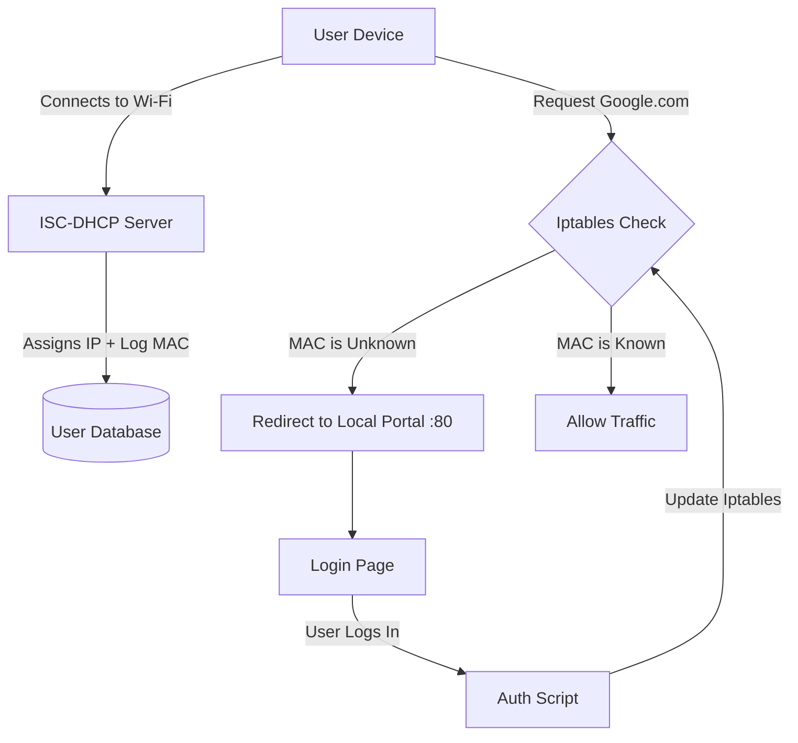

+++
title = 'Captive Portal on Raspberry Pi'
date = 2025-11-28
tags = ['Networking', 'Raspberry Pi', 'Linux', 'Security']
summary = "A custom-built captive portal using raw iptables manipulation, Bind9, and ISC-DHCP. This project explores the low-level mechanics of network interception."
+++

### 🚀 The Problem

I wanted to understand how public Wi-Fi networks control access. How does a router "hijack" your connection and force a login page?

Existing solutions were bloated or proprietary. I wanted to build one from scratch to understand the raw networking primitives involved.

### 💡 The Solution

I built a fully functional Captive Portal using a **Raspberry Pi** that acts as a wireless access point.

Unlike simple scripts that use `dnsmasq`, this implementation uses enterprise-grade standard tools (`isc-dhcp-server` and `bind`) to control the flow.

### ⚙️ How It Works (The Mechanism)

The system relies on three core components working in unison:

#### 1. Firewall (Iptables)

This is where the magic happens. The rules are written to segregate traffic into two lanes:

- **Authorized:** Packets from known MAC addresses are allowed through.
- **Unauthorized:** HTTP traffic is forcefully redirected to the local web server. HTTPS traffic is dropped (to avoid certificate errors).

#### 2. DHCP (isc-dhcp-server)

I configured a specific **"on commit" hook**. When a device connects and requests an IP, the server triggers a script that creates a temporary "User Account" for that MAC address, marking it as unauthorized by default.

#### 3. DNS (Bind9)

The DNS server is configured to be a "walled garden."

- **Unauthorized Users:** All DNS queries are resolved to the local portal IP (or forwarded to a blackhole).
- **Authorized Users:** Queries are forwarded to Google DNS (8.8.8.8).

### 📊 The Packet Flow

_(This is the logic visualized)_

### 🧠 Key Challenges

The hardest part was handling the **"Captive Portal Detection"** used by modern OSs.

When you connect to Wi-Fi, devices like iPhones and Androids automatically ping specific URLs in the background to check for internet access. If they don't get a `200 OK` response (or get redirected), they know they are behind a captive portal and pop up the login window.

I had to ensure my DNS and Firewall rules intercepted these specific checks correctly to trigger the popup:

- **Android/Chrome:** Checks `connectivitycheck.gstatic.com`
- **Firefox:** Checks `detectportal.firefox.com`
- **Apple (iOS/macOS):** Checks `captive.apple.com`
- **Windows:** Checks `www.msftncsi.com`

If the redirection isn't fast or if the DNS resolution fails for these specific domains, the device might assume the network is broken and disconnect automatically. Tuning `bind9` to resolve these to the local portal IP was critical for a seamless user experience.

### 🛠️ Tech Stack

- **Hardware:** Raspberry Pi 3
- **Core:** `iptables` (Packet Mangling)
- **Services:** `isc-dhcp-server` (IP Assignment), `bind9` (DNS)
- **Language:** Bash (Glue scripts), Python (Web Server)

### 🔗 Links

[View Source Code on GitHub](https://github.com/jee1mr/captive-portal)
